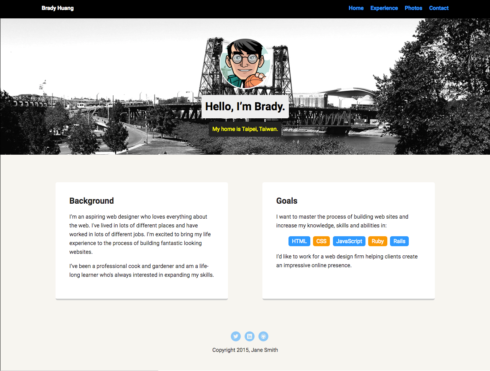
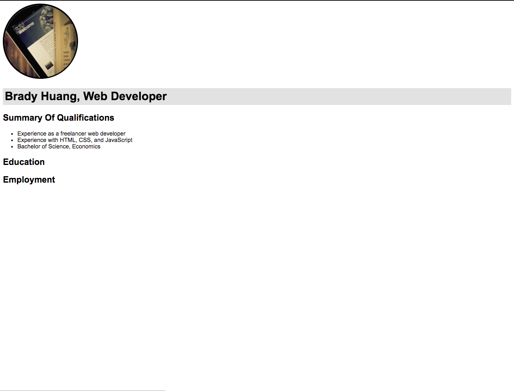

## Summary

This repo is a practice of building a simple resume web page by only css and html, and it is static.

*All the step is followed by [Introduction to HTML and CSS](https://teamtreehouse.com/library/introduction-to-html-and-css) created by Treasure Porth.*

## Usage

Download the repo, and open the index.html file. Will show the home page of my profile, and there is a nav bar at the top right which can watch more details about me.

<figure style="text-align: center;">
    
    <figcaption style="display: block;">Landing Page</figcaption>
</figure>

By clicking the **Experience** link, which can bring you to the resume page. This is an easy page with rare css decoration.

<figure style="text-align: center;">
    
    <figcaption style="display: block;">SignUp Page</figcaption>
</figure>

## Code

#### Index Page
------------------------------------------------------------------------

No fancy thing in index page, I only want to mention that the nav tag is practical we should keep in mind.

index.html
```
<!doctype html>
<html lang="en">
<head>
  <meta charset="utf-8">
  <title>Brady Huang's Profile</title>
  <meta name="viewport" content="width=device-width, initial-scale=1.0">
  <link rel="stylesheet" href="styles.css">
  <link href="https://fonts.googleapis.com/css?family=Muli%7CRoboto:400,300,500,700,900" rel="stylesheet"></head>
  <body>

    <div class="main-nav">
        <ul class="nav">
          <li class="name">Brady Huang</li>
          <li><a href="#">Home</a></li>
          <li><a href="resume.html">Experience</a></li>
          <li><a href="#">Photos</a></li>
          <li><a href="#">Contact</a></li>
        </ul>
    </div>

    <header>
      
      <h1 class="tag name">Hello, I’m Brady.</h1>
      <p class="tag location">My home is Taipei, Taiwan.</p>
    </header>

    <main class="flex">
      <div class="card">
        <h2>Background</h2>
        <p>I’m an aspiring web designer who loves everything about the web. I've lived in lots of different places and have worked in lots of different jobs. I’m excited to bring my life experience to the process of building fantastic looking websites.</p>
        <p>I’ve been a professional cook and gardener and am a life-long learner who's always interested in expanding my skills.</p>
      </div> 

      <div class="card">
        <h2>Goals</h2>
        <p>I want to master the process of building web sites and increase my knowledge, skills and abilities in:</p>
        <ul class="skills">
          <li>HTML</li>
          <li>CSS</li>
          <li>JavaScript</li>
          <li>Ruby</li>
          <li>Rails</li>
        </ul>
        <p>I’d like to work for a web design firm helping clients create an impressive online presence.</p>
      </div> 

    </main>
    <footer>
      <ul>
        <li><a href="#" class="social twitter">Twitter</a></li>
        <li><a href="#" class="social linkedin">LinkedIn</a></li>
        <li><a href="#" class="social github">Github</a></li>
      </ul>
      <p class="copyright">Copyright 2015, Jane Smith</p>
    </footer>
  </body>
  </html>
```

`box-sizing: boarder-box` can hold the width length won't be affected by border and padding, pretty useful.

styles.css
```
/* Global Layout Set-up */
* { 
  box-sizing: border-box;
}
  
body {
  margin: 0;
  padding: 0;
  text-align: center;
  font-family: 'Roboto', sans-serif;
  color: #222;
  background: #f7f5f0;
}
/* Link Styles */

a {
  text-decoration: none;
  color: #0499ff;
}
a:hover {
  color: #6633ff;
}

/* Section Styles */

.main-nav {
  width: 100%;
  background: black;
  min-height: 30px;
  padding: 10px;
  position: fixed;
  text-align: center;
}
.nav {
  display: flex;
  justify-content: space-around;
  font-weight: 700;
  list-style-type: none;
  margin: 0 auto;
  padding: 0;
}
.nav .name {
  display: none;
}
.nav li {
  padding: 5px 10px 10px 10px;
}
.nav a {
  transition: all .5s;
}
.nav a:hover {
  color: white
}

header {
  text-align: center;
  background: url('images/portland.jpg') no-repeat top center ;
  background-size: cover;
  overflow: hidden;
  padding-top: 60px;
}
header {
  line-height: 1.5;
}
header .profile-image {
  margin-top: 50px;
  width: 150px;
  height: 150px;
  border-radius: 50%;
  border: 3px solid white;
  transition: all .5s;
}
header .profile-image:hover {
  transform: scale(1.2) rotate(5deg);
}
.tag {
  background-color: #efefef;
  color: black;
  padding: 10px;
  border-radius: 5px;
  display: table;
  margin: 10px auto;
} 
.location {
  background-color: #222;
  color: yellow;
}
.card {
  margin: 30px;
  padding: 20px 40px 40px;
  max-width: 500px;
  text-align: left;
  background: #fff;
  border-bottom: 4px solid #ccc;
  border-radius: 6px;
}
.card:hover {
  border-color: #ff99ff;
}

ul.skills {
  padding: 0;
  text-align: center;
}

.skills li {
  border-radius: 6px;
  display: inline-block;
  background: #ff9904;
  color: white;
  padding: 5px 10px;
  margin: 2px;
}

.skills li:nth-child(odd) {
  background: #0399ff;
}

footer {
  width: 100%;
  min-height: 30px;
  padding: 20px 0 40px 20px;
}

footer .copyright {
  top: -8px;
  margin-right: 20px;
  font-size: .75em;
}

footer ul {
  list-style-type: none;
  margin: 0;
  padding: 0;
}

footer ul li {
  display: inline-block;
}

a.social {
  display: inline-block;
  text-indent: -9999px;
  margin-left: 5px;
  width: 30px;
  height: 30px;
  background-size: 30px 30px;
  opacity: .5;
  transition: all .25s;
}
a.twitter {
  background-image: url(images/twitter.svg);
}
a.linkedin {
  background-image: url(images/linkedin.svg);
}
a.github {
  background-image: url(images/github.svg);
}
a.social:hover {
  opacity: 1;
}
.clearfix {
  clear: both;
}

/* Styles for larger screens */
@media screen and (min-width: 720px) {
  
  .flex {
      display: flex;
      max-width: 1200px;
      justify-content: space-around;
      margin: 0 auto;
  }

  header {
    min-height: 450px;
  }

  .nav {
    max-width: 1200px;
  }

  .nav .name {
    display: block;
    margin-right: auto;
    color: white;
  }

  main {
    padding-top: 50px;
  }

  main p {
    line-height: 1.6em;
  }

  footer {
    font-size: 1.3em;
    max-width: 1200px;
    margin: 40px auto;
  }

}
```

Simple resume page almost have no content, because the instructor only want to show how to link to another file.

resume.html
```
<!DOCTYPE html>
<html>

<head>
    <title>Brady Huang's Resume</title>
    <link rel="stylesheet" href="resume.css">
</head>

<body>
    
    <h1>Brady Huang, Web Developer</h1>
    <h2 class="section-title">Summary of Qualifications</h2>
    <ul>
        <li>Experience as a freelancer web developer</li>
        <li>Experience with HTML, CSS, and JavaScript</li>
        <li>Bachelor of Science, Economics</li>
    </ul>
    <h2 class="sectoin-title">Education</h2>
    <h2 class="section-title">Employment</h2>

</body>

</html>
```

resume.css
```
body {
    font-family: "Arial";
}

.main-image {
    border: solid 4px black;
    border-radius: 50%;
}

h1 {
    background-color: #e2e2e2;
    padding: 5px;
}

.section-title {
    text-transform: capitalize;
}
```


## Conclusion

This project is a very simple web app, the useful point is I can scale the app up and do my own resume in the future.
